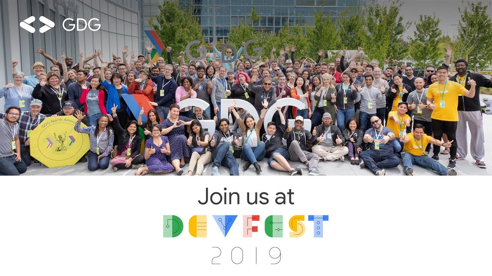

**Presence**

[Modern Web Testing: Going Beyond Selenium]()

**Location**

Minneapolis, MN, USA

**Event Information**

DevFests are local tech conferences hosted by Google Developer Groups (GDG) around the world. Each DevFest event is crafted by its local organizers to fit the needs and interests of its local developer community. Whether it be through hands-on learning experiences, technical talks delivered in local languages by experts, or by simply meeting fellow local developers, DevFest attendees learn how to build together and innovate on Google's developer tools.