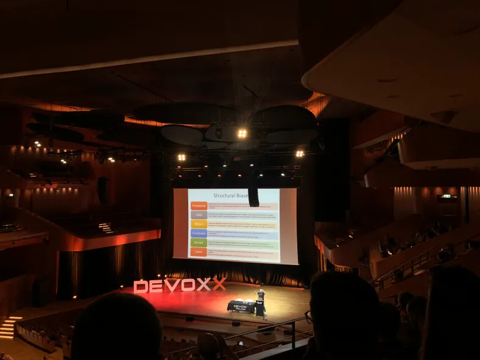

**Presence**

- [Gauge + Taiko: BDD for Web Revived](https://dvinnik.dev/presentations/2019/gauge+taiko_bdd-for-web-revived) 
- [Stress Driven Development, and How to Avoid It](https://dvinnik.dev/presentations/2018/stress-driven-development)

**Location**

Kraków, Poland

**Event Information**

Devoxx is the biggest Java conference in Poland and is a great way to learn about new things that are being developed in the Java world.
 
[Original Talk Link](http://cfp.2019.devoxx.pl/speaker/dmitry_vinnik.html)

**Recording**

 

<<iframe width="560" height="315" src="https://www.youtube.com/embed/eTUSYiJYL1s" title="YouTube video player" frameborder="0" allow="accelerometer; autoplay; clipboard-write; encrypted-media; gyroscope; picture-in-picture" allowfullscreen></iframe>

*[Gauge + Taiko: BDD for Web Revived](https://dvinnik.dev/presentations/2019/gauge+taiko_bdd-for-web-revived) *
 

 

<iframe width="560" height="315" src="https://www.youtube.com/embed/8vCXE4MH9K8" title="YouTube video player" frameborder="0" allow="accelerometer; autoplay; clipboard-write; encrypted-media; gyroscope; picture-in-picture" allowfullscreen></iframe>

*[Stress Driven Development, and How to Avoid It](https://dvinnik.dev/presentations/2018/stress-driven-development)*

 