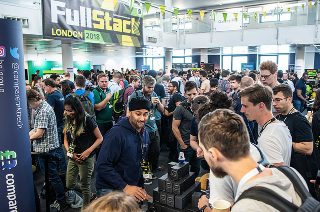

**Presence**

[Uphill Battle of Mobile Visual Regression](https://dvinnik.dev/presentations/2018/uphill-battle-of-mobile-testing)

**Location**

London, UK

**Event Information**

FullStack is the go-to JavaScript, Node, Angular and IoT conference in London. Other topics explored will include Web-Animation, ES6, CSS3, Machine Learning, Functional Programming, Software Craftsmanship, Testing and various frameworks including D3js, React, Angular, Node, Babylon, Ember and more!

[Original Talk Link](https://skillsmatter.com/skillscasts/13905-workshop-uphill-battle-of-mobile-visual-regression)