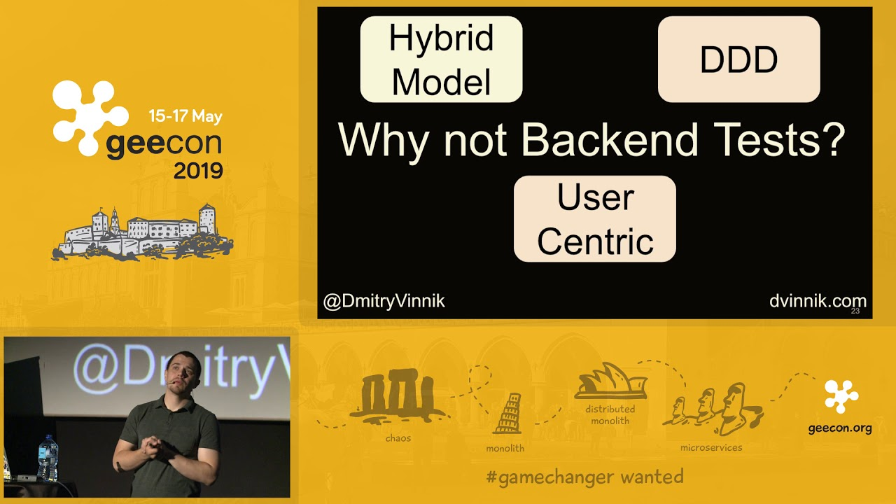

**Presence**

[Modern Web Testing: Going Beyond Selenium]() 

**Location**

Kraków, Poland

**Event Information**

Java and JVM based technologies, dynamic languages, enterprise architectures, patterns, distributed computing, software craftsmanship, mobile and much more.
 
[Original Talk Link](https://2019.geecon.org/speakers/info.html?id=496)

**Recording**

 

<iframe width="560" height="315" src="https://www.youtube.com/embed/1m2AcmiEdpI" title="YouTube video player" frameborder="0" allow="accelerometer; autoplay; clipboard-write; encrypted-media; gyroscope; picture-in-picture" allowfullscreen></iframe>

 