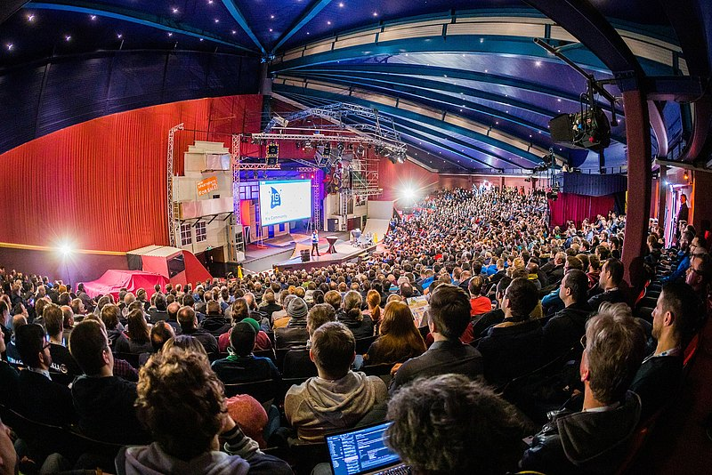

**Presence**

[Back to the CompletableFuture: Concurrency in Action]()

**Location**

Brühl, Germany

**Event Information**

Two eventful days packed with presentations, community activities, an accompanying exhibition, workshops, exchange and networking with a unique amusement park flair.

For the sixth year in a row, JavaLand took place in Phantasialand in Brühl. We were very happy to welcome so many old friends, but also new faces. We hope you had a lot of fun and look forward to seeing you again next year! Jatumba!
