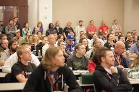

**Presence**

[Back to the CompletableFuture: Concurrency in Action]()

**Location**

Kansas City, MO, USA

**Event Information**

The Kansas City Developer Conference is excited to announce our 14th annual event! Our 2023 conference will be held June 21-23, 2023, with a pre-conference workshop day and two full conference days. Once again, the event will be held at the Kansas City Convention Center in downtown Kansas City. Each year, we draw a large audience of new and experienced Developers, Architects, UI/UX Designers, QA Professionals, PMs, and Technology Managers from Missouri, Kansas, Illinois, Nebraska, Iowa, Minnesota, Oklahoma, the Dakotas, and around the United States and the world. We hope you will join us!

[Original Talk Link](https://kcdc2019.myconf.app/session/ses-85724)