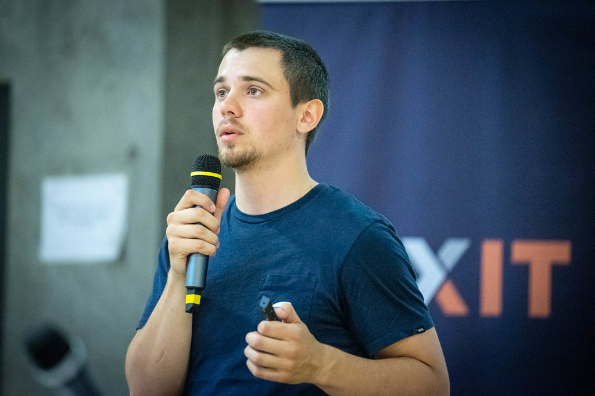

**Presence**

[Modern Web Testing: Going Beyond Selenium](https://dvinnik.dev/presentations/2018/modern-web-testing_going-beyond-selenium) 

**Location**

Lyon, France

**Event Information**

MiXiT comes back for a 2022 edition in person at the Manufacture des Tabacs in Lyon on May 24 & 25, 2022 🥳 We might have to adapt to the sanitary restrictions, but we'll apply the traditional recipe of MiXiT: crêpes, "alien" speakers, and a lot of ❤️. And that will be the occasion for us to celebrate our 10th edition in person, so you can expect some surprises! (we don't forget the 2021 online edition and its handful of selected speakers, but the team is not ready to endure the vagaries of connections and streaming tools again).

[Original Talk Link](https://mixitconf.org/en/2019/modern-web-testing-going-beyond-selenium)

**Recording**

 

<iframe src="https://player.vimeo.com/video/339718328?h=e2d03b77dc&title=0&byline=0&portrait=0" width="640" height="360" frameborder="0" allow="autoplay; fullscreen; picture-in-picture" allowfullscreen></iframe>

<a href="https://vimeo.com/339718328">Modern Web Testing: Going Beyond Selenium - Dmitry Vinnik - MiXiT 2019</a> from <a href="https://vimeo.com/mixitconf">MiXiT</a> on <a href="https://vimeo.com">Vimeo</a>.

 
