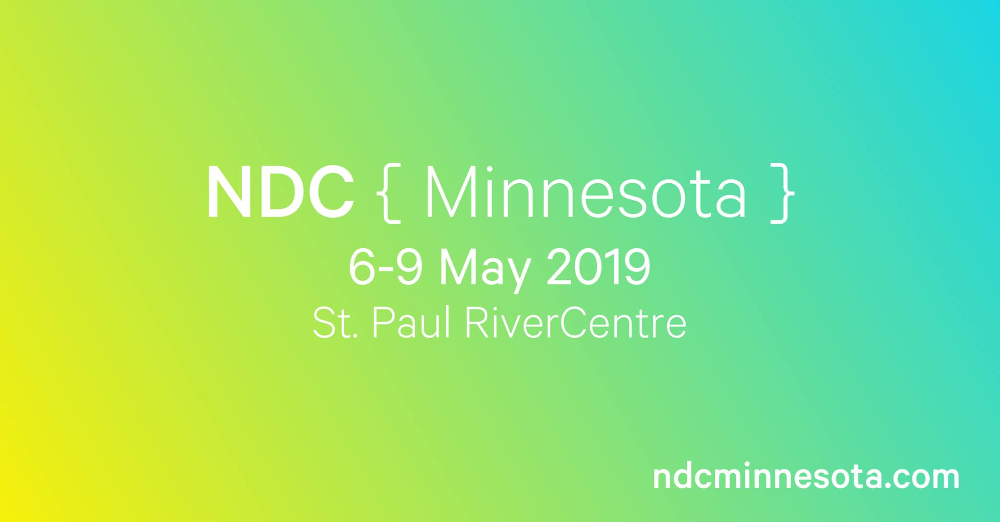

**Presence**

- [Modern Web Testing: Going Beyond Selenium]() 

**Location**

St Paul, MN, USA

**Event Information**

NDC Minnesota 2022 is a 4-day event focusing on hands-on workshops, inspirational keynotes and evening events. Every day starts off with a keynote in the plenary room before attendees break out into workshops for the rest of the day.

**Recording**

 

<iframe width="560" height="315" src="https://www.youtube.com/embed/c0LcuPRBFvo" title="YouTube video player" frameborder="0" allow="accelerometer; autoplay; clipboard-write; encrypted-media; gyroscope; picture-in-picture" allowfullscreen></iframe>

 