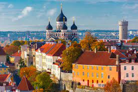

**Presence**

[Gauge + Taiko: BDD for Web Revived](https://dvinnik.dev/presentations/2019/gauge+taiko_bdd-for-web-revived) 

**Location**

Tallinn, Estonia

**Event Information**

Nordic Testing Days is an annual conference primarily aimed at software testers. However, during the recent years we have branched out and also welcome others ranging from programmers to UX specialists, project managers to designers etc. In other words, everyone who is interested in dipping their toes into testing and contributing to smoother software development cycle and quality. We believe this will help diversify learning across the board.

Nordic Testing Days conference is put together by volunteers, who are mostly testing professionals, committed to strengthening the community and providing software quality related education.