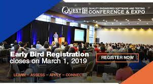

**Presence**

- [Uphill Battle of Mobile Visual Regression](https://dvinnik.dev/presentations/2018/uphill-battle-of-mobile-testing) 
- [From Robotium to Appium: Choose Your Journey](https://dvinnik.dev/presentations/2018/from-robotium-to-appium)

**Location**

Chicago, IL, USA

**Event Information**

QUEST 2019 Conference is the best source for new technologies and proven methods for Quality Engineered Software and Testing. Thought leaders, evangelists, innovative practitioners, and IT professionals from across North America gather together for a week packed with classes, tutorials, educational sessions, hand-on workshops, discussions groups, EXPO, and networking events. Let your quest to build, test, and deliver quality software begin with QUEST 2019!