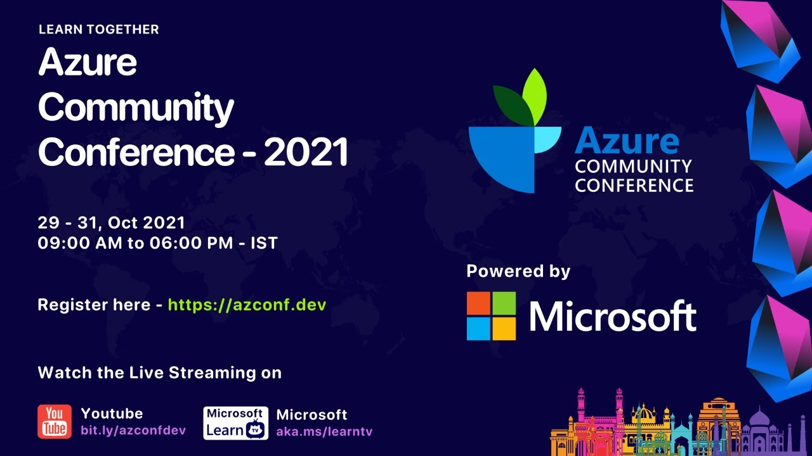

**Presence**

[Stress Driven Development, and How to Avoid It]()

**Location**

Virtual

**Event Information**

Azure Community Conference will be a 3 day multi-track virtual conference between 29 - 31, October 2021. The conference is aimed at Cloud and Web Developers working with open source and cloud native technologies on the Microsoft Stack.

We host technology experts around the globe to educate, network, and share their expertise with our global attendees.
