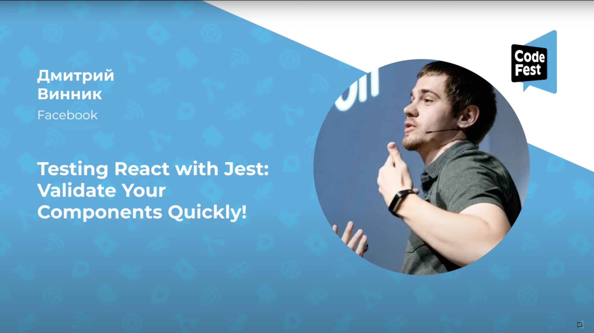

**Presence**

[Testing React with Jest: Validate Your Components Quickly!](https://dvinnik.dev/presentations/2021/testing-react-with-jest)

**Location**

Virtual

**Event Information**

CodeFest gathers 1,500 attendees from all over the Russia. We have talks about backend and frontend development, mobile development, QA, project and product management, UI/UX, and web design.

The conference is known for its friendly atmosphere, chill out zones, whiskey end, and afterparty at the end of the first conference day. We do our best to help our guests feel comfortable and meet new people.

**Recording**

 

<iframe width="560" height="315" src="https://www.youtube.com/embed/zYUsQQV3Jpk" title="YouTube video player" frameborder="0" allow="accelerometer; autoplay; clipboard-write; encrypted-media; gyroscope; picture-in-picture" allowfullscreen></iframe>

 