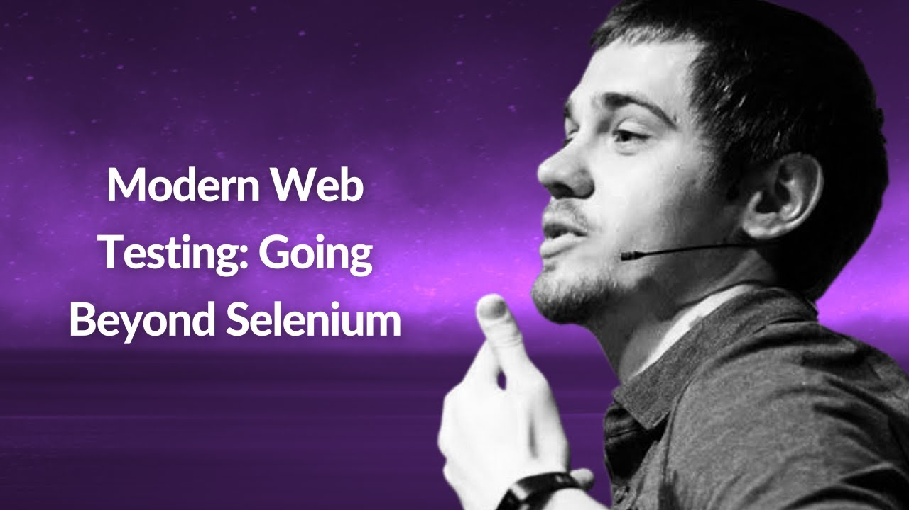

**Presence**

[Modern Web Testing: Going Beyond Selenium](https://dvinnik.dev/presentations/2018/modern-web-testing_going-beyond-selenium)

**Location**

Virtual

**Event Information**

We are passionate about technology and use the cutting edge to deliver better events across the globe. We're lean, agile and will go the extra mile to help you grow your business.

[Original Talk Link](https://www.conf42.com/JavaScript_2021_Dmitry_Vinnik_Web_Testing_Selenium)

**Recording**

 

<iframe width="560" height="315" src="https://www.youtube.com/embed/lVYO1_IEpxI" title="YouTube video player" frameborder="0" allow="accelerometer; autoplay; clipboard-write; encrypted-media; gyroscope; picture-in-picture" allowfullscreen></iframe>

 
