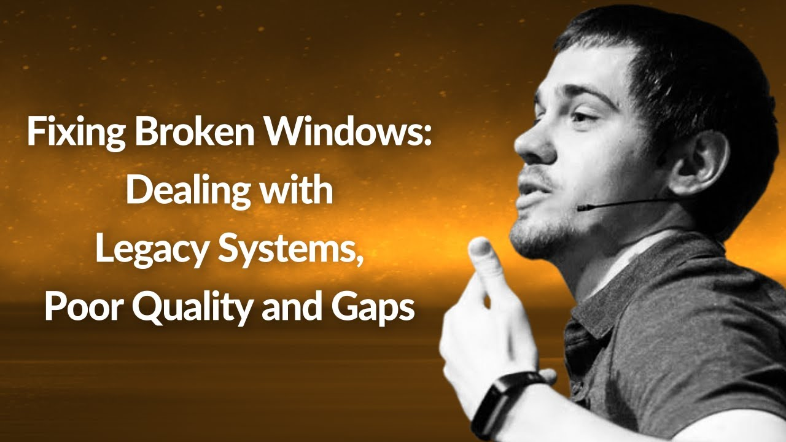

**Presence**

[Fixing Broken Windows: Dealing with Legacy Systems, Poor Quality and Gaps](https://dvinnik.dev/presentations/2018/dealing-with-legacy-systems)

**Location**

Virtual

**Event Information**

We are passionate about technology and use the cutting edge to deliver better events across the globe. We're lean, agile and will go the extra mile to help you grow your business.

[Original Talk Link](https://www.conf42.com/Site_Reliability_Engineering_2021_Dmitry_Vinnik_broken_windows_legacy_systems__poor_quality_gaps)

**Recording**

 

<iframe width="560" height="315" src="https://www.youtube.com/embed/tCT-LSbF-uU" title="YouTube video player" frameborder="0" allow="accelerometer; autoplay; clipboard-write; encrypted-media; gyroscope; picture-in-picture" allowfullscreen></iframe>

 
