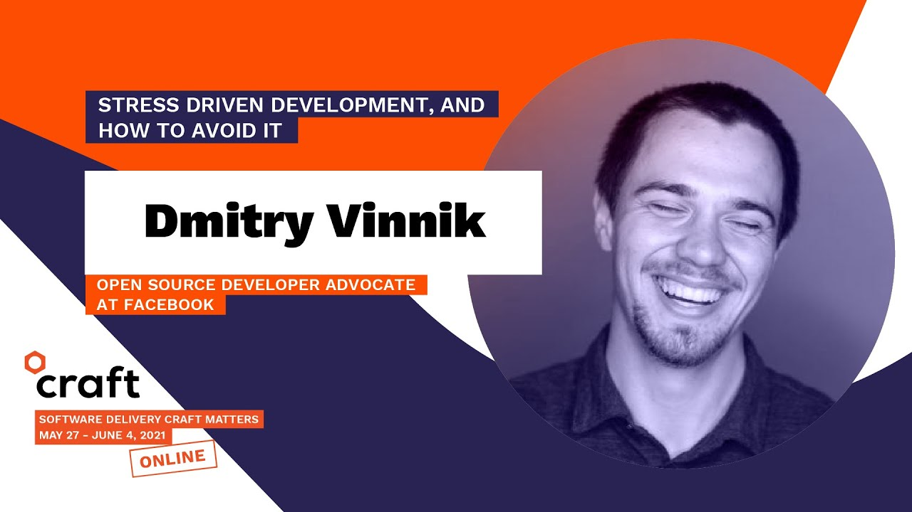

**Presence**

[Stress Driven Development, and How to Avoid It]()

**Location**

Virtual

**Event Information**

Craft Conference is an international festival-like event about software craft. It combines talk sessions, workshops and a hackathon where attendees can learn about the latest tools, methods and practices of software craft. An event that serves as a compass on new technologies and trends provided by top-notch experts from all over the world.

[Original Talk Link](https://craft-conf.com/2021/speaker/DmitryVinnik)

**Recording**

 

<iframe width="560" height="315" src="https://www.youtube.com/embed/ShF8mEzlsEI" title="YouTube video player" frameborder="0" allow="accelerometer; autoplay; clipboard-write; encrypted-media; gyroscope; picture-in-picture" allowfullscreen></iframe>

 
