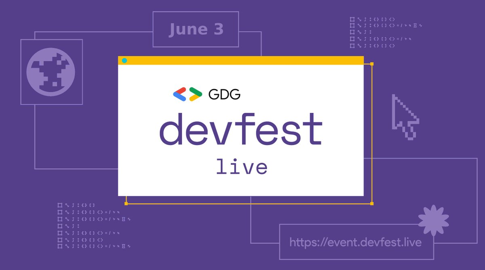

**Presence**

[Better Start: Enforcing Best Engineering Practices with Kotlin]()

**Location**

Virtual

**Event Information**

DevFest is an annual decentralized tech conference hosted by the Google Developer Groups (GDG) community. GDGs host these events around the globe. DevFest 2022 marks the 11th year of DevFest and represents the beginning of the second decade of the GDG community.