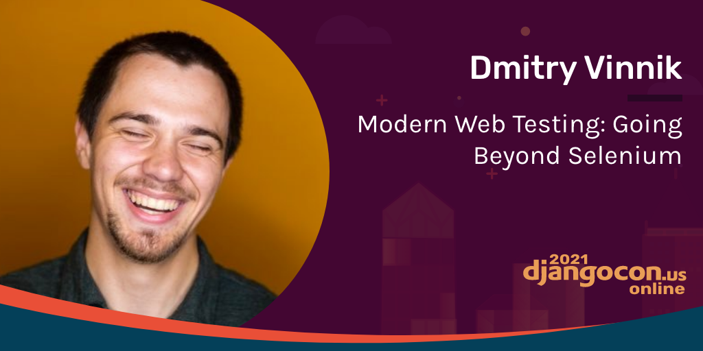

**Presence**

[Modern Web Testing: Going Beyond Selenium]()

**Location**

Virtual

**Event Information**

From tutorials on building mobile applications and rapid prototyping to talks about data visualization and accessibility, 2021 was DjangoCon US's best year ever!

This was an innovative year for DjangoCon US! Every year, DjangoCon US works hard to make our program better and more accessible, and this year we're super proud of the features we were able to add:

Bilingual talks: for the first time, all talks were available with both Spaniish and English subtitles.
Chat: We had a virtual conference hall in SpatialChat where people could congregate, listen to a live session from our awesome DJ Rana Ransom, and more.

[Original Talk Link](https://2021.djangocon.us/talks/modern-web-testing-going-beyond-selenium/)

**Recording**

<iframe width="560" height="315" src="https://www.youtube.com/embed/uDCQMdLJlWg" title="YouTube video player" frameborder="0" allow="accelerometer; autoplay; clipboard-write; encrypted-media; gyroscope; picture-in-picture" allowfullscreen></iframe>
