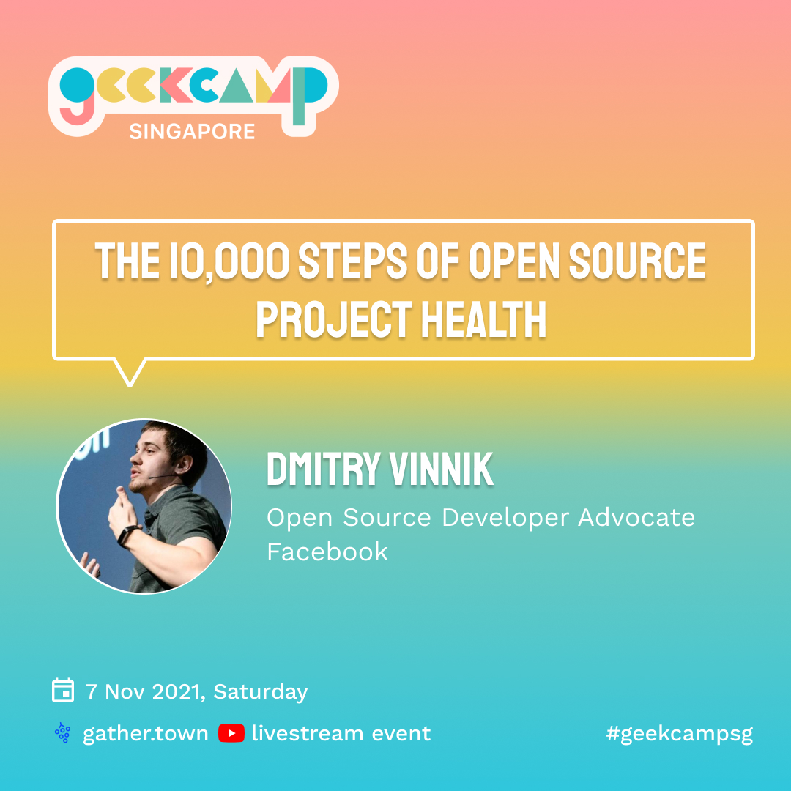

**Presence**

[The 10,000 Steps of Open Source Project Health](https://dvinnik.dev/presentations/2021/10000-steps-of-open-source-project-health)

**Location**

Virtual

**Event Information**

A one-stop event to get acquainted and grow your tech network in Singapore: a hybrid online + in-person GeekcampSG. The end goal: to reignite vibrant and inspiring meetups in the tech community.

**Recording**

<iframe width="560" height="315" src="https://www.youtube.com/embed/fRw49EbP2vs?start=657" title="YouTube video player" frameborder="0" allow="accelerometer; autoplay; clipboard-write; encrypted-media; gyroscope; picture-in-picture" allowfullscreen></iframe>

