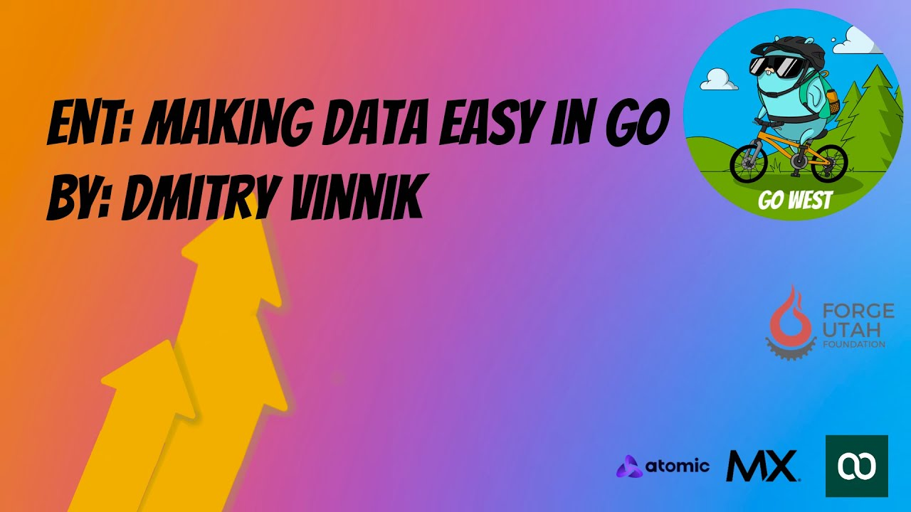

**Presence**

[Ent: Making Data Easy in Go](https://dvinnik.dev/presentations/2021/ent_making-data-easy-in-go)

**Location**

Virtual

**Event Information**

The GoWest conference is a hybrid conference the for Rocky Mountain West communities (Arizona, Utah, Colorado, Idaho).
It has two main goals:

To highlight the local talent and expertise in engineering with the Go programming language

​To bring world-renowned Go speakers to the area.

We love having international participation. Everyone is welcome to attend and join in celebrating the communities that make Go great.

[Original Talk Link](https://hopin.com/events/gowest-conference-2021#speakers)

**Recording**

<iframe width="560" height="315" src="https://www.youtube.com/embed/NvjvzYacgQg" title="YouTube video player" frameborder="0" allow="accelerometer; autoplay; clipboard-write; encrypted-media; gyroscope; picture-in-picture" allowfullscreen></iframe>