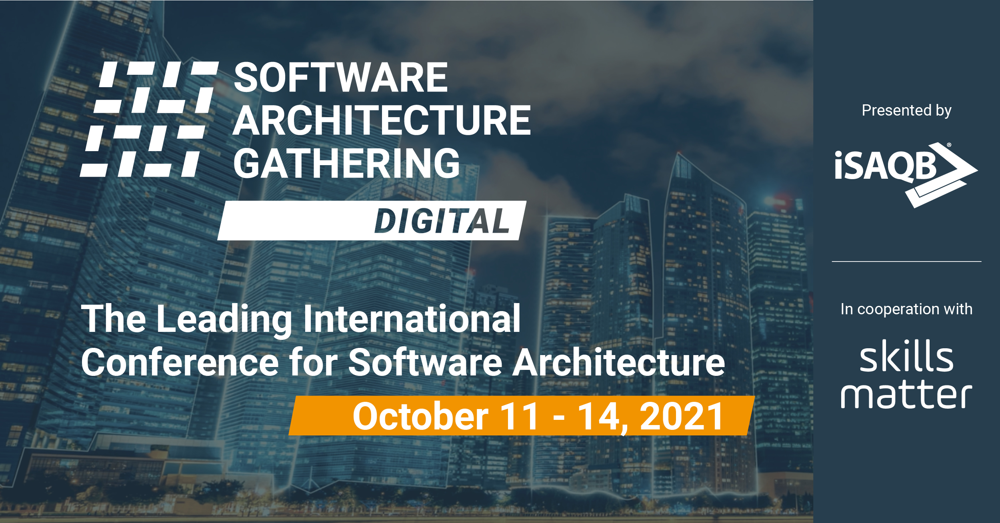

**Presence**

[Stress Driven Development, and How to Avoid It](https://dvinnik.dev/presentations/2018/stress-driven-development)

**Location**

Virtual

**Event Information**

The Software Architecture Gathering — Digital 2022 is the international conference highlight for all those working on solution structures in IT projects: primarily software architects, developers and professionals in quality assurance, but also system analysts who want to communicate better with their developers. A selection of the best-known international experts will share their practical knowledge on the most important topics in state-of-the-art software architecture.

[Original Talk Link](https://conferences.isaqb.org/software-architecture-gathering/program-2021/)
