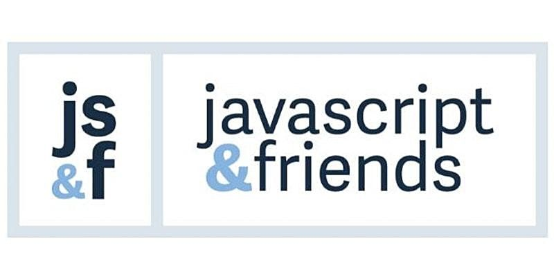

**Presence**

[The 10,000 Steps of Open Source Project Health]()

**Location**

Virtual

**Event Information**

Our mission is to bring a diverse group of around 200 JavaScript developers and friends to learn new skills and concepts and to network and develop new relationships.

**Recording**

 

<iframe width="560" height="315" src="https://www.youtube.com/embed/4phw1GjfCjQ?start=13980" title="YouTube video player" frameborder="0" allow="accelerometer; autoplay; clipboard-write; encrypted-media; gyroscope; picture-in-picture" allowfullscreen></iframe>