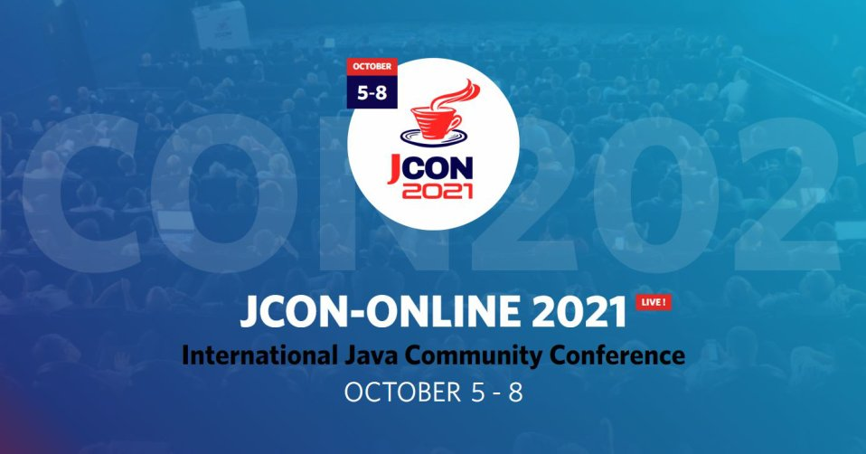

**Presence**

[Back to the CompletableFuture: Concurrency in Action]()

**Location**

Virtual

**Event Information**

JCON-ONLINE 2022 is the big international Java community conference organized by the Java User Group Oberpfalz in cooperation with JAVAPRO Magazine. Java is our profession and JCON is our passion and a lot of fun. We love to provide Java developers with a spectacular 100% live conference that is open to the entire Java- User-Group communities world-wide.

Last year, more than 2,500 participants from 77 countries and six continents had joined the JCON-ONLINE 2021.

The 6th JCON edition is presented as an online live conference for the thrid time. All sessions will be streamed live and recorded.

[Original Talk Link](https://jcon.sched.com/speaker/dmitryvinn?iframe=no&w=100%&sidebar=yes&bg=no)

**Recording**

<iframe width="560" height="315" src="https://www.youtube.com/embed/JR0STPMcD5U" title="YouTube video player" frameborder="0" allow="accelerometer; autoplay; clipboard-write; encrypted-media; gyroscope; picture-in-picture" allowfullscreen></iframe>