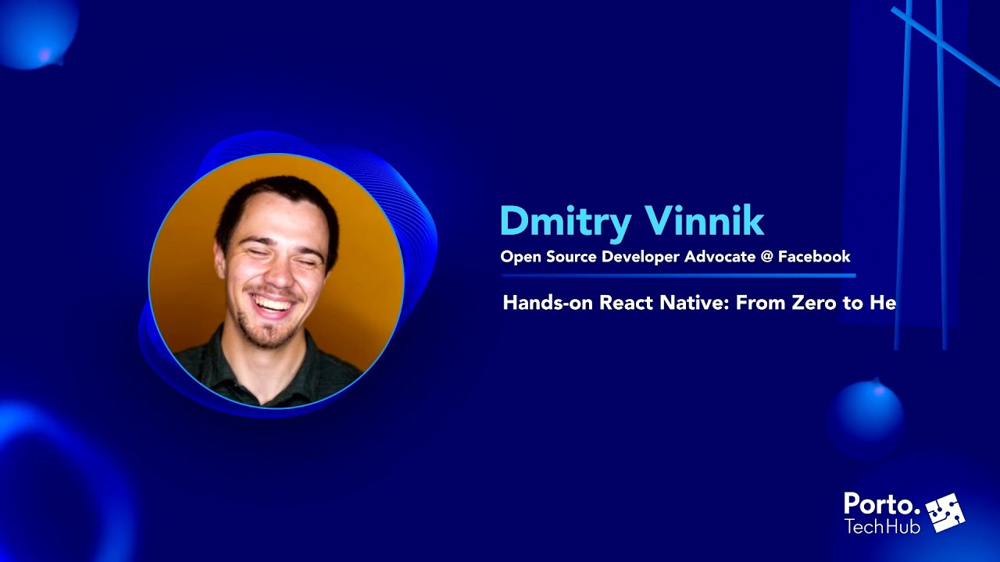

**Presence**

[Hands-on React Native: From Zero to Hero](https://dvinnik.dev/presentations/2021/hands-on-react-native)

**Location**

Virtual

**Event Information**

Porto Tech Hub Conference 2021 occurred on November 18th and 19th, online and free. The conference featured speakers from different areas & sectors. The conference theme was all about tech and bringing professionals together for knowledge sharing and an amazing networking experience.

**Recording**

 

<iframe width="560" height="315" src="https://www.youtube.com/embed/3J4hlbpczY8" title="YouTube video player" frameborder="0" allow="accelerometer; autoplay; clipboard-write; encrypted-media; gyroscope; picture-in-picture" allowfullscreen></iframe>

 
