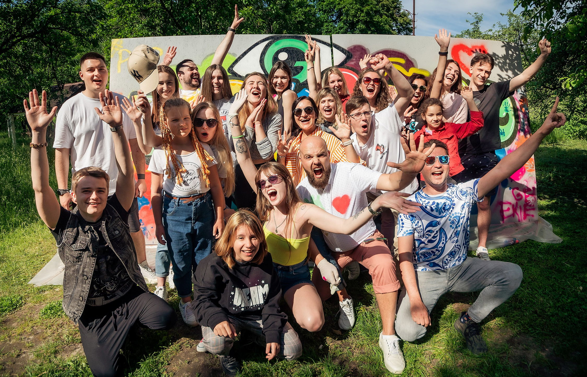

**Presence**

Career Path and Development in Testing

**Location**
Virtual

**Event Information**

Geekle started doing online events when offline events were stopped completely. We never stop and we are running the online QA Global Summit'23. Our speakers are leading experts from all over the world who are ready to share what challenges QA experts face in their work.

Geekle has the unique experience to gather huge tech summits with 5'000+ attendees in different tech domains. Now we hope to make something the world has never seen before for the QA Community.

**Recording**

 

<iframe width="560" height="315" src="https://www.youtube.com/embed/ySRc-juTbrc?start=23955" title="YouTube video player" frameborder="0" allow="accelerometer; autoplay; clipboard-write; encrypted-media; gyroscope; picture-in-picture" allowfullscreen></iframe>

 