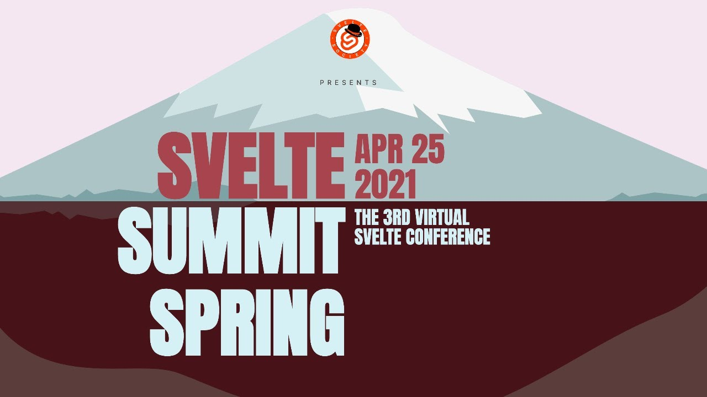

**Presence**

[Testing Svelte with Jest: Validate Your Components Quickly!]()

**Location**

Virtual

**Event Information**

Svelte Summit is an event dedicated to Svelte and everything that is happening in the community. The event will be a day of (exclusive) talks streamed online, syndicated on various platforms including YouTube. Specific discussions about the talks and water-cooler chit-chat will happen live in the Svelte Discord server. The fall event this year will take place on Nov 20th.

Get more information on the Svelte Fall Summit 2021 website and signup to the mailing list!

**Recording**

 

<iframe width="560" height="315" src="https://www.youtube.com/embed/fnr9XWvjJHw?start=4194" title="YouTube video player" frameborder="0" allow="accelerometer; autoplay; clipboard-write; encrypted-media; gyroscope; picture-in-picture" allowfullscreen></iframe>

 
