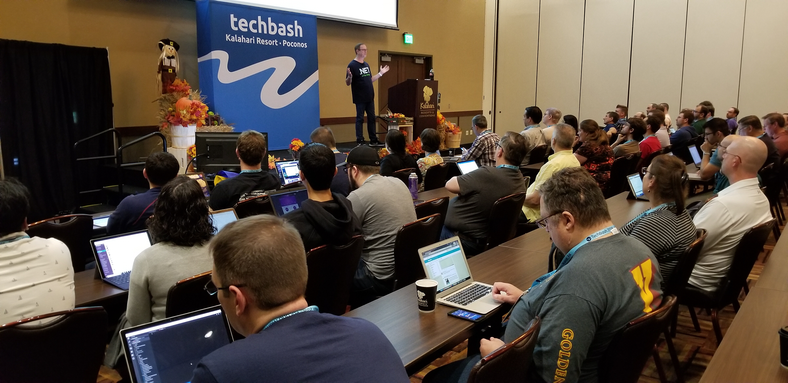

**Presence**

- [Better Start: Enforcing Best Engineering Practices with Kotlin](https://dvinnik.dev/presentations/2019/enforcing-best-practices-with-kotlin)
- [Hands-on React Native: From Zero to Hero](https://dvinnik.dev/presentations/2021/hands-on-react-native)

**Location**

Virtual

**Event Information**

At TechBash, attendees will take their skills to the next level, learning from experts who share their knowledge in a fun, collaborative, and inclusive environment. TechBash is focused on Web, Cloud, DevOps, Architecture, Best Practices, Soft Skills, and much more. We provide three full days of keynotes and breakout sessions plus an optional fourth day of deep-dive workshops. And so you don't get burned out, we also have social events, a family day, and yes, we are hosted at the largest indoor waterpark on the East Coast. TechBash is a non-profit, community run event, led by developers for developers. After TechBash, attendees are inspired to build remarkable things.
