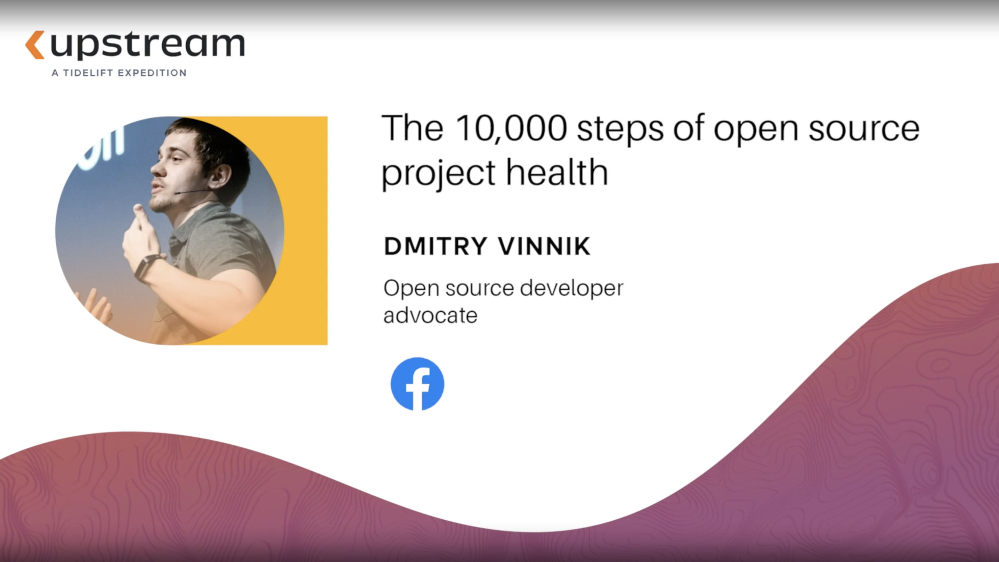

**Presence**

[The 10,000 Steps of Open Source Project Health](https://dvinnik.dev/presentations/2021/10000-steps-of-open-source-project-health)

**Location**

Virtual

**Event Information**

A one-day celebration of open source, the developers who use it, and the maintainers who make it.

[Original Talk Link](https://upstream.live/speaker-2021/dmitry-vinnik)

**Recording**

 

<iframe width="560" height="315" src="https://www.youtube.com/embed/5KixD9LVymo" title="YouTube video player" frameborder="0" allow="accelerometer; autoplay; clipboard-write; encrypted-media; gyroscope; picture-in-picture" allowfullscreen></iframe>

**Press Mentions**

- [Join upstream maintainers in this new free online event](https://opensource.com/article/21/5/upstream-2021)
- [Open Source Maintainers Take Center Stage, Joined by Leaders from GitHub, Red Hat, Google, and JFrog at Tidelift Upstream Event](https://www.prnewswire.com/news-releases/open-source-maintainers-take-center-stage-joined-by-leaders-from-github-red-hat-google-and-jfrog-at-tidelift-upstream-event-301293468.html)