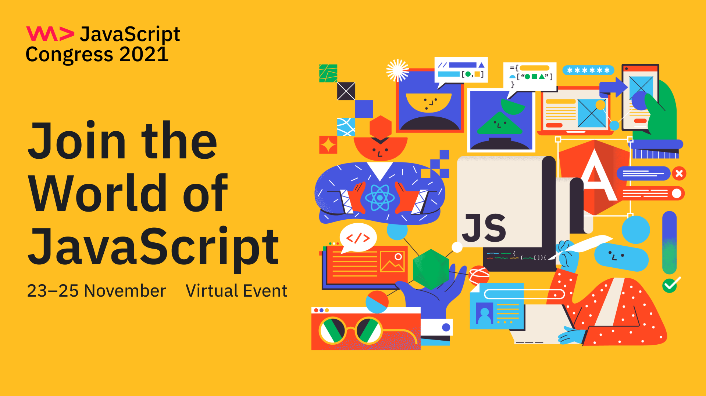

**Presence**

[The 10,000 Steps of Open Source Project Health]()

**Location**

Virtual

**Event Information**

WeAreDevelopers Live is a free virtual event series with tech talks, coding sessions and workshops about building great software - delivered by proven experts and developers from the community.