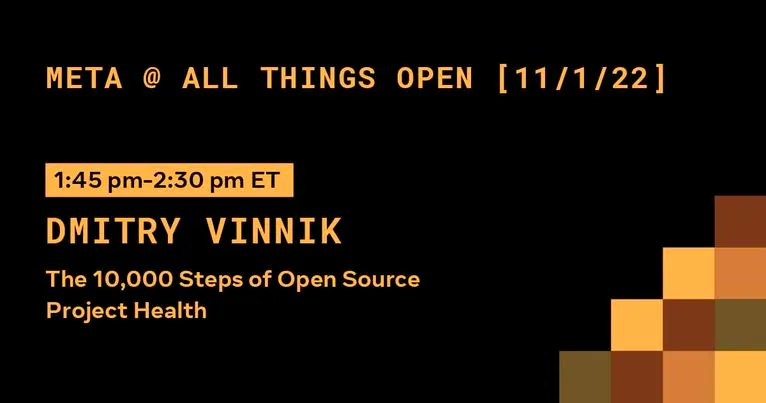

**Presence**

[The 10,000 Steps of Open Source Project Health](https://dvinnik.dev/presentations/2021/10000-steps-of-open-source-project-health)

**Location**

Raleigh, NC, USA

**Event Information**

For more than 8 years we’ve followed these beliefs and created events and platforms that have hosted tens of thousands from all over the world.  Just a few include All Things Open, the largest open-source event on the U.S. east coast, the Open Source 101 series, the Open Source Research Triangle Park (RTP) meetup, the Open Source South Carolina meetup, OpenSourceJobs.com, OpenSourceScore. com, and many more.

And throughout it all, our focus on access, diversity, and inclusion and a commitment to helping others have remained steadfast.  We strongly believe you can do business differently and still be successful, which is why we worked hard to earn a Certified B Corp certification in 2018.

[Original Talk Link](https://2022.allthingsopen.org/speakers/dmitry-vinnik/)
