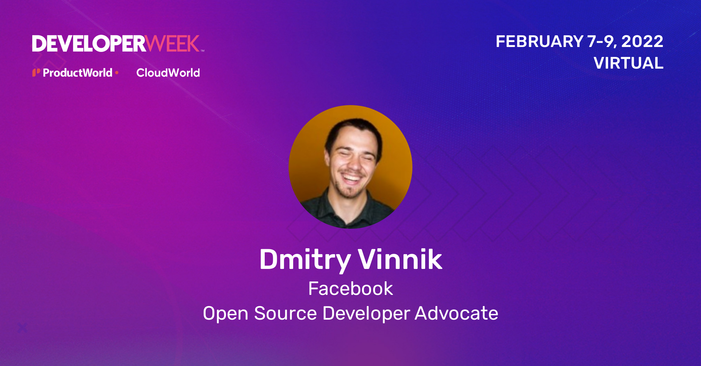

**Presence**

[The 10,000 Steps of Open Source Project Health]()

**Location**

Virtual

**Event Information**

DeveloperWeek puts the spotlight on new technologies. Companies that participated in past DeveloperWeek events include Google, Facebook, Yelp, Rackspace, IBM, Cloudera, Red Hat, Optimizely, SendGrid, Blackberry, Microsoft, Neo Technology, Eventbrite, Klout, Built.io, Ripple, GNIP, Tagged, HackReactor, and 30+ more here!

When it comes to technology, there’s incremental change, and then there’s fundamental innovation. Developer technology, from blockchain and artificial intelligence to big data and quantum computing represents fundamental innovation that people can build on for years. We are in the DevTech Age, where developer technologies and tools are now the most disruptive and fundamental technology innovation in the marketplace. When you build tools for developers, you are not just implementing a small incremental use case, you are building platforms, frameworks, and APIs that will enable entirely new web, mobile, and IoT innovation.

[Original Talk Link](https://emamo.com/event/developerweek-2022/r/speaker/dmitry-vinnik)

**Recording**

 

<iframe width="560" height="315" src="https://www.youtube.com/embed/it0Zo5QhlQk" title="YouTube video player" frameborder="0" allow="accelerometer; autoplay; clipboard-write; encrypted-media; gyroscope; picture-in-picture" allowfullscreen></iframe>

 
