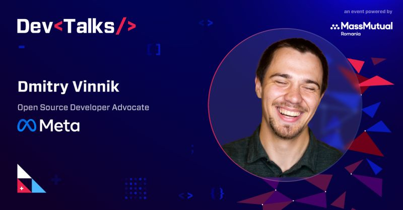

**Presence**

[The 10,000 Steps of Open Source Project Health]()

**Location**

Virtual

**Event Information**

The largest expo conference for software developers and IT professionals in Romania, gathering over 8000 participants from all over the world. Every year, key leaders and tech enthusiasts talk about the latest & most exciting aspects of the industry.

[Original Talk Link](https://www.devtalks.ro/speakers/15-dmitry-vinnik)

**Recording**

 

<iframe width="560" height="315" src="https://www.youtube.com/embed/it0Zo5QhlQk" title="YouTube video player" frameborder="0" allow="accelerometer; autoplay; clipboard-write; encrypted-media; gyroscope; picture-in-picture" allowfullscreen></iframe>

 

**Press Mentions**

- [The Recursive](https://therecursive.com/devtalks-2022-the-largest-it-conference-in-romania-to-focus-on-ai/)

- [The Hipo](https://www.hipo.ro/locuri-de-munca/vizualizareArticol/3351/DevTalks-revine-%C3%AEn-perioada-8-10-iunie%3A-Acum-te-po%C8%9Bi-pre%C3%AEnregistra-gratuit-pentru-a-avea-acces-la-conferin%C8%9Bele-online)