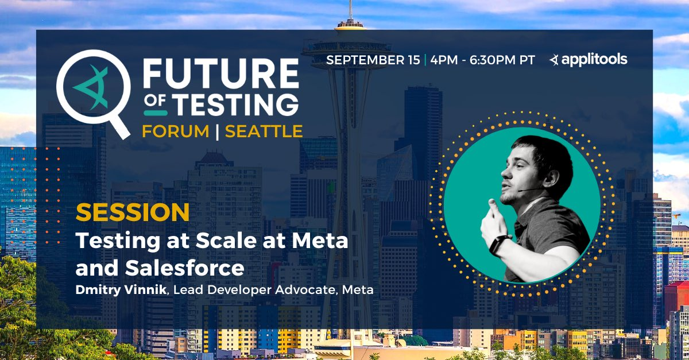

**Presence**

[Testing at Scale at Meta and Salesforce]()

**Location**

Seattle, WA, USA

**Event Information**

Ready for the return of in-person networking? Recapture the energy of in-person networking with local professionals in this fun, happy hour event featuring food, drinks, a sweet swag bag, and engaging conversations. Swap stories and tidbits you’ve picked up on your software quality engineering or testing journey. Join software engineers, digital technologists, and industry thought leaders including Developer Advocate Andrew Knight, Meta Lead Developer Advocate, Dmitry Vinnik and skilled engineer, James Whittaker.

[Original Talk Link](https://applitools.com/future-of-testing-forum-seattle/)
