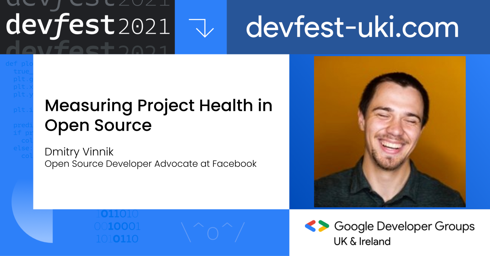

**Presence**

[The 10,000 Steps of Open Source Project Health](https://dvinnik.dev/presentations/2021/10000-steps-of-open-source-project-health)

**Location**

Virtual

**Event Information**

DevFest is one of the larger scale community-driven tech conferences in the UK & Ireland, carefully crafted for you by the Google Developer Group (GDG) community!  GDG is a group of developers passionate about Google technologies with a strong focus on knowledge exchange and networking.

This year's DevFest UK & Ireland will be a hybrid one (in-person and virtual), with the in-person part being held at etc Venues St Paul's.

Learn about Mobile, Web, Cloud, AI, Machine Learning, Hot Tech and more from world experts.  We also have a track dedicated solely on Diversity, Equity & Inclusion.

[Original Talk Link](https://www.devfest-uki.com/)

**Recording**

 

<iframe width="560" height="315" src="https://www.youtube.com/embed/it0Zo5QhlQk" title="YouTube video player" frameborder="0" allow="accelerometer; autoplay; clipboard-write; encrypted-media; gyroscope; picture-in-picture" allowfullscreen></iframe>

 
