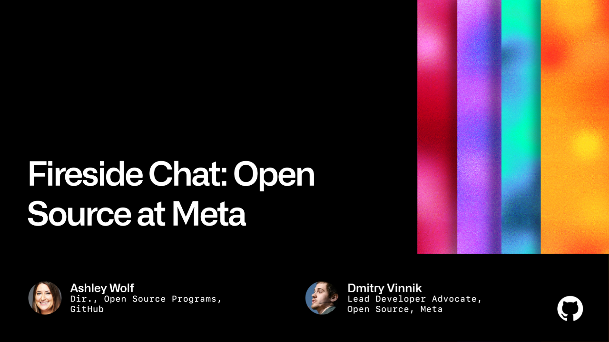

**Presence**

[Fireside Chat: Open Source at Meta]()

**Location**

San Francisco, CA, USA

**Event Information**

Fifteen years ago, the first line of code was committed to build GitHub. Since then, our purpose has been to equip developers with everything they need to be their best. This mission has remained the same through every iteration of the GitHub platform. But as software continues to advance in all aspects of our work and life, running, maintaining, and building software for a global population creates immense complexity for developers.

[Original Talk Link](https://githubuniverse.com/events/detail/speakers/fdb56a77-056e-4b54-8636-81a6a10ace8c)
