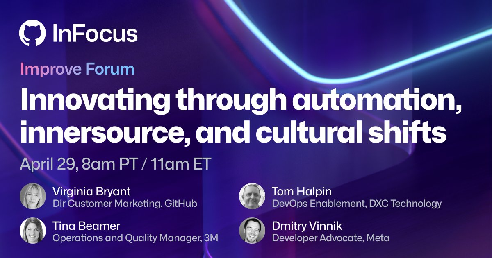

**Presence**

[Speaking Panel: Innovating Through Automation, Innersource and Cultural Shifts](https://dvinnik.dev/conversations/2022/innovating-through-innersource)

**Location**

Virtual

**Event Information**

*Build fast, build effectively, build securely*

Grow your business alongside industry experts during GitHub InFocus. Enjoy curated sessions on the most top-of-mind business questions for enterprises, along with a special broadcast featuring GitHub CEO, Thomas Dohmke. Join us as we focus on accelerating, securing, and operationally improving the way your software development teams work—for good.

[Original Talk Link](https://infocus.github.com/sessions/innovating-through-automation-innersource-and-cultural-shifts-with-meta-dxc-technology-and-3m/)

**Recording**

 

<iframe width="560" height="315" src="https://www.youtube.com/embed/Y8c7U4quV8g" title="YouTube video player" frameborder="0" allow="accelerometer; autoplay; clipboard-write; encrypted-media; gyroscope; picture-in-picture" allowfullscreen></iframe>

 
