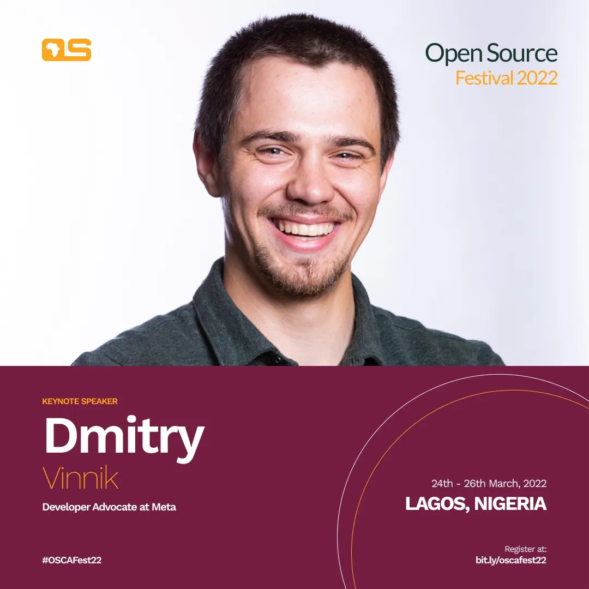

**Presence**

[The 10,000 Steps of Open Source Project Health](https://dvinnik.dev/presentations/2021/10000-steps-of-open-source-project-health)

**Location**

Virtual

**Event Information**

Open Source Community Africa is a community aimed at creating and supporting the open source movement within Africa. As a community, we intend to help integrate the act of open source contribution to African developers whilst strongly advocating the movement of free and open source software.

Open Source Festival is a high profile event that would attract student delegates, developers, designers and corporate organizations on a large scale with series of talks, workshops, and awareness of open-sourced developer tools. The second edition is going to be a forum for networking, discussions and ideas proration around latest happenings in technology as well as the growth of open source in Africa.

Through this festival, we intend to open the eyes of Africans so they can be aware that FUTURE IS OPEN.

[Original Talk Link](https://festival.oscafrica.org/schedule/)

**Recording**

 

<iframe width="560" height="315" src="https://www.youtube.com/embed/m8Ufvyo1tJM" title="YouTube video player" frameborder="0" allow="accelerometer; autoplay; clipboard-write; encrypted-media; gyroscope; picture-in-picture" allowfullscreen></iframe>

 
