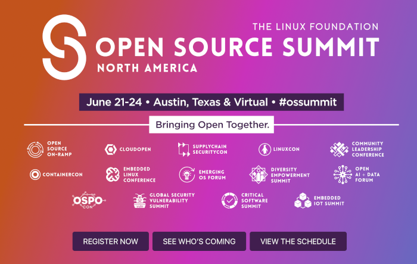

**Presence**

[The 10,000 Steps of Open Source Project Health]()

**Location**

Virtual

**Event Information**

The Open Source Summit is the premier event for open source developers, technologists, and community leaders to collaborate, share information, solve problems, and gain knowledge, furthering open source innovation and ensuring a sustainable open source ecosystem.

[Original Talk Link](https://ossna2022.sched.com/speaker/dvinnik)