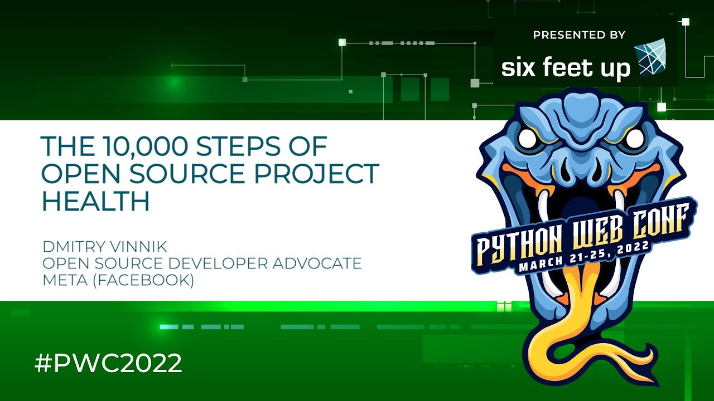

**Presence**

[The 10,000 Steps of Open Source Project Health]()

**Location**

Virtual

**Event Information**

The 4th annual Python Web Conf is a virtual event designed to promote best practices for hard web production problems. It features international experts presenting on 85 topics such as Django, CI/CD, Containers, Serverless, REST APIs, web security, microservices and more!

The highly engaging format features 90 speakers, 6 tracks (including 80 talks and 4 tutorials) and numerous opportunities to mingle and connect via virtual cocktails, online gaming, and interactive tech talks to name a few. Access to presentations and post-event recordings will be available exclusively to registered attendees.

[Original Talk Link](https://2022.pythonwebconf.com/speakers/dmitry-vinnik)

**Recording**

 

<iframe width="560" height="315" src="https://www.youtube.com/embed/ltIy6OwBB5o" title="YouTube video player" frameborder="0" allow="accelerometer; autoplay; clipboard-write; encrypted-media; gyroscope; picture-in-picture" allowfullscreen></iframe>

 