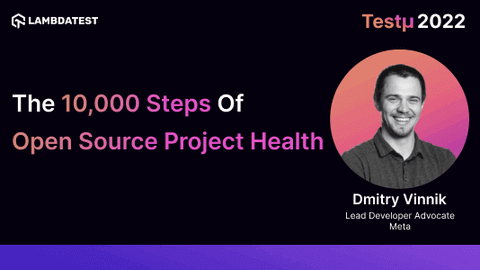

**Presence**

[The 10,000 Steps of Open Source Project Health]()

**Location**

Virtual

**Event Information**

The Testμ (TestMu, pronounced as 'TestU') Conference brings together software testers, developers, influencers, and community builders to talk about the future of testing and the people behind it.

Attendees can expect everything from test orchestration to orchestrating the team culture under one (online) roof.

**Recording**

 

<iframe width="560" height="315" src="https://www.youtube.com/embed/-vXXQgAJnOk" title="YouTube video player" frameborder="0" allow="accelerometer; autoplay; clipboard-write; encrypted-media; gyroscope; picture-in-picture" allowfullscreen></iframe>

**Press Mentions/Articles**

- [The 10,000 Steps of Open Source Project Health: Dmitry Vinnik [Testμ 2022]](https://www.lambdatest.com/blog/steps-of-open-source-project-health/)