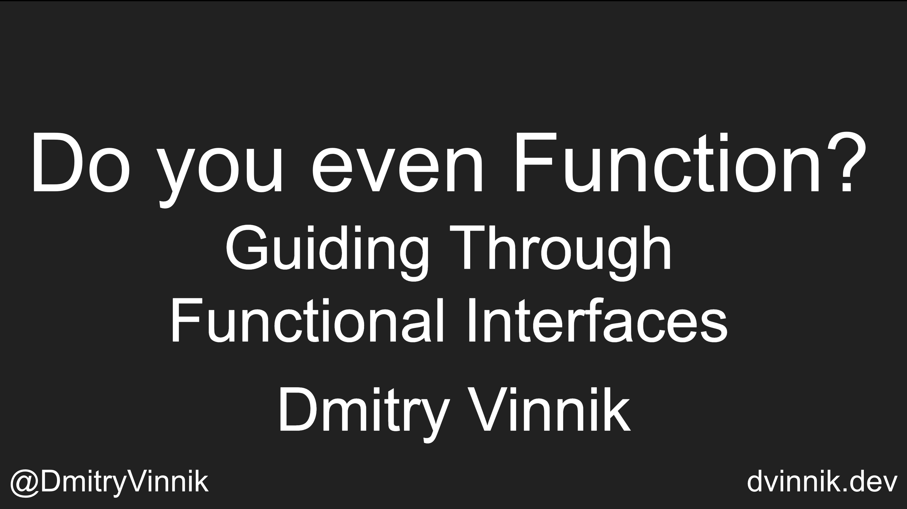

**Elevator Pitch (~300 words)**

While Streams and Optional interactions have been well discussed for the past few years, many people forget what drives all these new Functional capabilities – Functional Interfaces.
In this talk, default Functional Interfaces will be explained along with how they can be customized, covering some of the most promising new open-source libraries which expand Functional programming in Java beyond its current limits.

**Presented at**

 

- [ConFoo: 2017](https://dvinnik.dev/events/2017/confoo/)

 

**Abstract**
 
Since Java 8 was introduced with its support for Lambda, Optional and Functional Interfaces, Java developers got their hands onto an amazing ground of Functional Programming. While it has been widely supported in other OOP languages, only starting from JDK8, Java community got a new way to develop their code.

While Streams and Optional interactions have been well discussed for the past few years, many people forget what drives all these new Functional capabilities – Functional Interfaces.

In this talk, default Functional Interfaces will be explained along with how they can be customised, covering some of the most promising new open-source libraries which expand Functional programming in Java beyond its current limits.

By exploring what Functional Interfaces actually are, and when they can be use, Java developers should be able to see that any code can be encapsulated down to passing methods as an argument of another method, bringing DRY (Don't Repeat Yourself) principle to its extremes.

As a result, this talk will cover what developers should beware when using Functional Interfaces, as with this new power, there are even more responsibilities. For example, an engineer can keep encapsulating each piece of logic into Functional Interface, making code absolutely unreadable.

**Slide Deck**

 

<iframe src="//www.slideshare.net/slideshow/embed_code/key/L4XZo2QPB5OAvK" width="595" height="485" frameborder="0" marginwidth="0" marginheight="0" scrolling="no" style="border:1px solid #CCC; border-width:1px; margin-bottom:5px; max-width: 100%;" allowfullscreen> </iframe> 
 <strong> <a href="//www.slideshare.net/DmitryVinnik1/do-you-even-function-guiding-through-functional-interfaces" title="Do you even Function? Guiding Through Functional Interfaces" target="_blank">Do you even Function? Guiding Through Functional Interfaces</a> </strong> from <strong><a href="//www.slideshare.net/DmitryVinnik1" target="_blank">Dmitry Vinnik</a></strong> 

