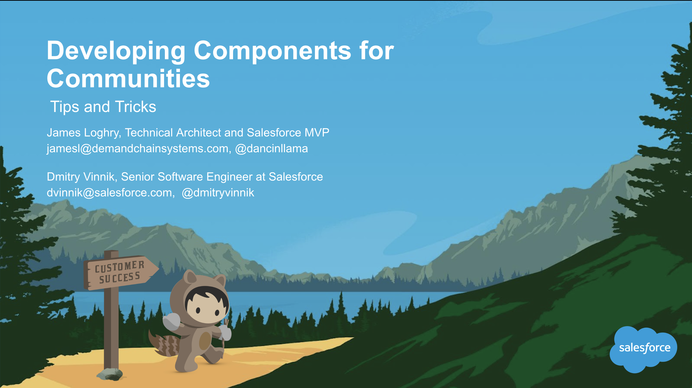

**Elevator Pitch (~300 words)**

In this talk, we will explore tips and tricks for developing Lightning Components for communities.

**Presented at**

 

- [Dreamforce: 2017](https://dvinnik.dev/events/2017/dreamforce/)

 

**Abstract**
 
Discover tips and tricks for developing Lightning Components for communities. We'll cover customizing Self-Service templates, including overriding the default header with a custom theme, allowing community administrators to control the look and feel of your custom components with design tokens, and best practices, such as utilizing Lightning Component inheritance.

**Recording**

 

<iframe width="560" height="315" src="https://www.youtube.com/embed/rjz-vKGb7DA" title="YouTube video player" frameborder="0" allow="accelerometer; autoplay; clipboard-write; encrypted-media; gyroscope; picture-in-picture" allowfullscreen></iframe>

 

**Slide Deck**

 

<iframe src="//www.slideshare.net/slideshow/embed_code/key/cHCKhIh749H4tp" width="595" height="485" frameborder="0" marginwidth="0" marginheight="0" scrolling="no" style="border:1px solid #CCC; border-width:1px; margin-bottom:5px; max-width: 100%;" allowfullscreen> </iframe> 
 <strong> <a href="//www.slideshare.net/DmitryVinnik1/developing-lightning-components-for-communitiespptx" title="Developing Lightning Components for Communities.pptx" target="_blank">Developing Lightning Components for Communities.pptx</a> </strong> from <strong><a href="//www.slideshare.net/DmitryVinnik1" target="_blank">Dmitry Vinnik</a></strong> 
