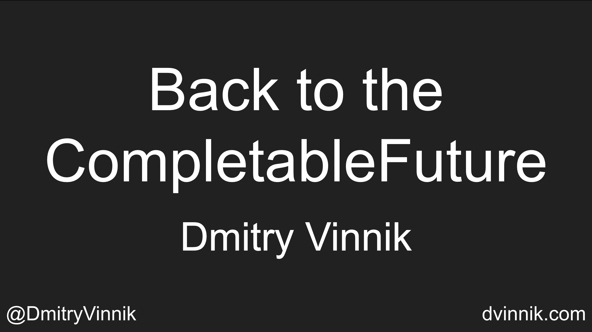

**Elevator Pitch (~300 words)**

Concurrency is hard! It is especially true for those who have only ever used Threads and Runnables. Fortunately, the Java community has been working hard on improving developer experience around multithreading programming. The declarative model has become an essential part of the concurrency development along with resource management features of JDK5, and post-JDK8 structures like CompletableFutures. 

In this talk, we explore concurrency programming and how developer-friendly it has become with the latest advantages of the Java language.

**Presented at**

 

- [YavaConf: 2021](https://dvinnik.dev/events/2021/yavaconf)
- [JCon: 2021](https://dvinnik.dev/events/2021/jcon)
- [Conf42 - Enterprise Software: 2021](https://dvinnik.dev/events/2021/conf42-enterprise)
- [Kansas City Developer Conference: 2019](https://dvinnik.dev/events/2019/kcdc)
- [Javaland: 2019](https://dvinnik.dev/events/2019/javaland)
- [JVMCon: 2018](https://dvinnik.dev/events/2018/jvmcon)
- [VoxxedDays Vienna: 2018](https://dvinnik.dev/events/2018/voxxeddays-vienna)
- [Devoxx Poland: 2018](https://dvinnik.dev/events/2018/devoxx-poland)
- [JDK.io: 2018](https://dvinnik.dev/events/2018/jdkio)
- [JCon: 2018](https://dvinnik.dev/events/2018/jcon)
- [MakeIT: 2018](https://dvinnik.dev/events/2018/makeit)

 

**Abstract**
 
Callback hell is a known way to give any JavaScript developer nightmares. However, Java developers are not much better off since anything concurrency and multithreading related give us cold sweats.

With Threads and Runnables being the first (and often last) things we used in Java, these classes gave many of us an impression of and appreciation for the complexities of concurrency. As a result, many developers abandoned the idea of ever touching thread management in Java and focused on a single-threaded development.
  
Fear no more! The world of concurrency in Java has changed since JDK8 and continues to get better. This talk discusses improvements around the Concurrency API of JDK5 and the power of asynchronous programming of CompletableFutures post-JDK8. Our goal is to break out of the fear of concurrency in Java and learn about a new, declarative way of thread programming.

**Takeaways**

 

1. Basics of Concurrency and Its Forms in Java
2. Concurrency API and Declarative Model in JDK5
3. Asynchronous development with CompletableFuture post-JDK8

   
 

**Recording**

 

<iframe width="560" height="315" src="https://www.youtube.com/embed/it0Zo5QhlQk" title="YouTube video player" frameborder="0" allow="accelerometer; autoplay; clipboard-write; encrypted-media; gyroscope; picture-in-picture" allowfullscreen></iframe>

*[Conf42 - Enterprise Software: 2021](https://dvinnik.dev/events/2021/conf42-enterprise)*

 

 

<iframe width="560" height="315" src="https://www.youtube.com/embed/JR0STPMcD5U" title="YouTube video player" frameborder="0" allow="accelerometer; autoplay; clipboard-write; encrypted-media; gyroscope; picture-in-picture" allowfullscreen></iframe>

*[JCon: 2021](https://dvinnik.dev/events/2021/jcon)*

 

 

<iframe width="560" height="315" src="https://www.youtube.com/embed/xm_ROh6X_Cg" title="YouTube video player" frameborder="0" allow="accelerometer; autoplay; clipboard-write; encrypted-media; gyroscope; picture-in-picture" allowfullscreen></iframe>

*[VoxxedDays Vienna: 2018](https://dvinnik.dev/events/2018/voxxeddays-vienna)*

 

 

<iframe width="560" height="315" src="https://www.youtube.com/embed/XK0QL6qSkFM" title="YouTube video player" frameborder="0" allow="accelerometer; autoplay; clipboard-write; encrypted-media; gyroscope; picture-in-picture" allowfullscreen></iframe>

*[JDK.io: 2018](https://dvinnik.dev/events/2018/jdkio)

 

 

<iframe width="560" height="315" src="https://www.youtube.com/embed/tM11P8dkcHk" title="YouTube video player" frameborder="0" allow="accelerometer; autoplay; clipboard-write; encrypted-media; gyroscope; picture-in-picture" allowfullscreen></iframe>

*[Devoxx Poland: 2018](https://dvinnik.dev/events/2018/devoxx-poland)*

 

**Slide Deck**

 

<iframe src="//www.slideshare.net/slideshow/embed_code/key/n0xvZuV80g3fa" width="595" height="485" frameborder="0" marginwidth="0" marginheight="0" scrolling="no" style="border:1px solid #CCC; border-width:1px; margin-bottom:5px; max-width: 100%;" allowfullscreen> </iframe> 
 <strong> <a href="//www.slideshare.net/DmitryVinnik1/back-to-the-completablefuture-concurrency-in-action-128736890" title="Back to the CompletableFuture: Concurrency in Action" target="_blank">Back to the CompletableFuture: Concurrency in Action</a> </strong> from <strong><a href="https://www.slideshare.net/DmitryVinnik1" target="_blank">Dmitry Vinnik</a></strong> 

