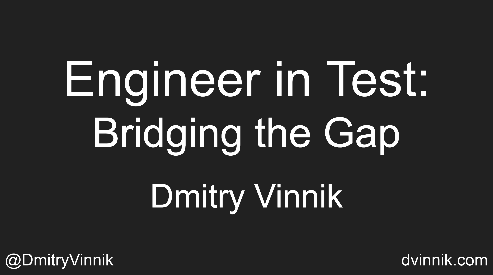

**Elevator Pitch (~300 words)**

In this talk, we discuss situations when the quantity of our tests takes over their quality. We answer how this tendency of writing many unnecessary tests creates more significant issues like wasted cycles on fixing test-only failures. 

**Abstract**
 
Quantity or quality is a common dilemma we all face when buying groceries, going to the restaurant, or shopping online. Unsurprisingly, when it comes to testing software, the same question of quality over quantity comes up.

“How many tests?”, “How well to write them?”, “How much testing expertise do you need?” - all these questions aimed towards the same dilemma of quantity vs. quality. 

In this talk, we discuss situations when the quantity of our tests takes over their quality. We answer how this tendency of writing many unnecessary tests creates more significant issues like wasted cycles on fixing test-only failures, maintaining the existing test suite, and making every new test from scratch. 

**Takeaways**

 

1. Guidelines to the user-centric mindset for testers
2. Best practices for developing scalable test suites
3. Path to the Hybrid Engineering for testers and developers
   
 

**Slide Deck**

 

<iframe src="//www.slideshare.net/slideshow/embed_code/key/17l2RQEOpPOw4f" width="595" height="485" frameborder="0" marginwidth="0" marginheight="0" scrolling="no" style="border:1px solid #CCC; border-width:1px; margin-bottom:5px; max-width: 100%;" allowfullscreen> </iframe> 
 <strong> <a href="//www.slideshare.net/DmitryVinnik1/engineer-in-test-bridging-the-gap" title="Engineer in Test: Bridging the Gap" target="_blank">Engineer in Test: Bridging the Gap</a> </strong> from <strong><a href="https://www.slideshare.net/DmitryVinnik1" target="_blank">Dmitry Vinnik</a></strong> 

