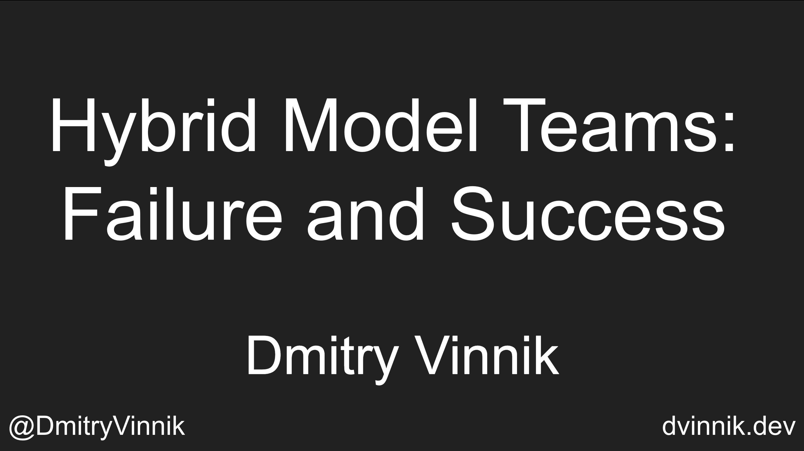

**Elevator Pitch (~300 words)**

In this talk, we look at successful and failed examples of companies transitioning into using the Hybrid Model. We discuss main pain points and tips and tricks on how to tackle the challenges of Hybrid Engineering.

**Abstract**
 
As a Tester, have you ever looked at the developers as if they were your enemies? As a Developer, have you ever thought of testing to be much easier than feature work? If any of these thoughts went through your head at one point, this talk is for you!

Nowadays, the fine line between testers and developers is challenged daily, and more companies are moving towards the so-called Hybrid Model. With everyone in the company becoming a Software Engineer, it might be scary to face it unprepared.  As Hybrid Model is gaining more popularity, it is essential to get ready for this transition whether you are a developer or a tester.

In this talk, we look at successful and failed examples of companies transitioning into using the Hybrid Model. We discuss main pain points and tips and tricks on how to tackle the challenges of Hybrid Engineering. 

**Takeaways**

1. Core principles of the Hybrid Engineering Model
2. Lessons learned from failed transitions to the Hybrid Model
3. Path to a successful implementation of the Hybrid Model
