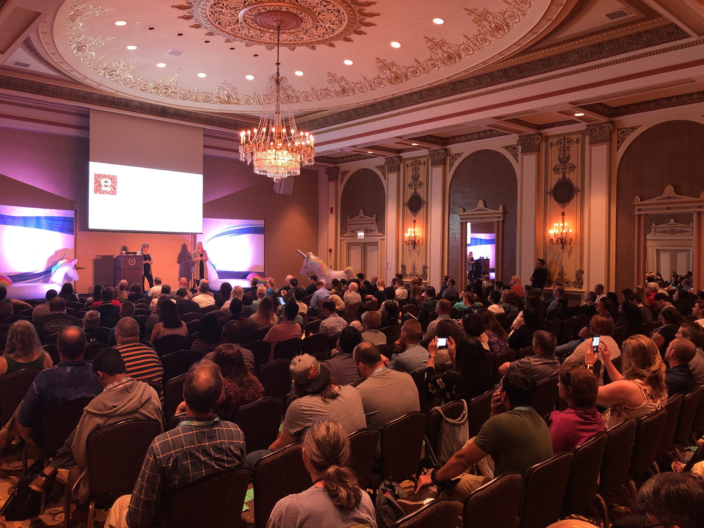

**Presence**

- [Gauge + Taiko: BDD for Web Revived]() 

**Location**

Chicago, IL, USA

**Event Information**

The five day conference is best known for its rich 6-track program and open minded atmosphere, featuring track sessions and workshops, keynotes, full-day tutorials and training classes, and exceptional bonus sessions. What makes AgileTDUSA stand out is the great variety of social events and networking opportunities along with the mindset and topics it promotes. Ranging from emerging technical needs in agile testing to accessibilty, mentoring, and mental health, ATD USA widens the scope for tech-based businesses. 

In recent years speakers, attendees and organizers have built one of the most diverse, collaborative, and energetic communities in the world—a safe place to share ideas and evolve professional and personal skills. In other words, for us it's all about you.
