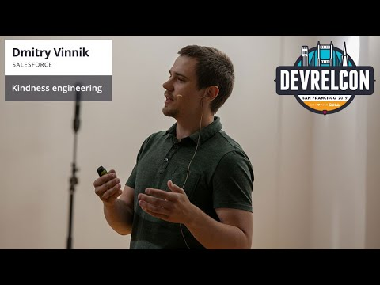

**Presence**

[Kindness Engineering: Focusing on What Matters]() 

**Location**

San Francisco, CA, USA

**Event Information**

DevRelCon San Francisco: developer experience, developer relations and developer marketing.

This year we're focusing on how to serve the diversity of needs represented in the developer community, as well as the usual themes of developer relations, developer experience, developer marketing and more.

Come together with expert practitioners from across the world to join the conversation about developer experience, developer relations, developer marketing and community.
 
[Original Talk Link](https://sf2019.devrel.net/dmitry-vinnik/)

**Recording**

 

<iframe width="560" height="315" src="https://www.youtube.com/embed/B2eeOUkTv7A" title="YouTube video player" frameborder="0" allow="accelerometer; autoplay; clipboard-write; encrypted-media; gyroscope; picture-in-picture" allowfullscreen></iframe>

 