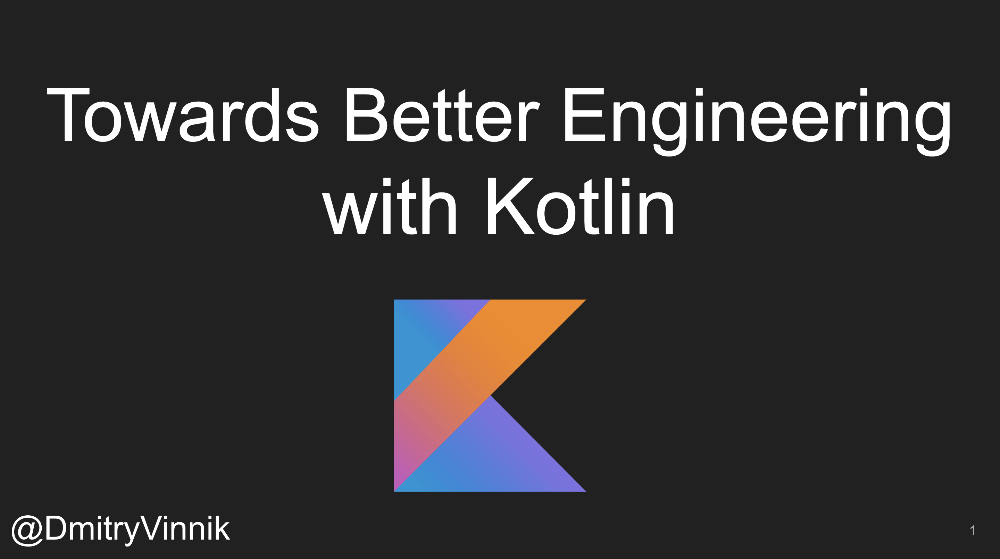

**Elevator Pitch (~300 words)**

We will see how Kotlin by limiting verbosity, by using private data classes, extension functions and many other functionalities, allow for more flexible and maintainable codebase. The main goal of this talk is to convince you that Kotlin is a great way to bring years of experience of using best practices to a first-year university student, or to a long-time Java veteran.

**Presented at**

 

- [TechBash: 2021](http://dvinnik.dev/events/2021/techbash)
- [DevFest Live: 2021](http://dvinnik.dev/events/2021/devfest-live)
  
 

**Abstract**
 
As Developers, we are getting lazy! With amazing IDEs and plugins we use on a daily basis, we let these tools do the most important job for a Software Project – ensure maintainability of the codebase. These tools with static analysis, formatters and styleguides keep our code clean and readable while we can focus on making the application to work.

Despite this abstraction of styling and duplication detection, we, as Software Engineers, are still responsible to keep in mind best practices like DRY, KISS, YAGNI, and many more. While IDEs are great at detecting basic mistakes, we still need to choose the best possible solution among variety of solutions.
In this talk, we will look at Kotlin as a way to enforce best Software Engineering practices on the language-level. 

We will see how Kotlin by limiting verbosity, by using private data classes, extension functions and many other functionalities, allow for more flexible and maintainable codebase. The main goal of this talk is to convince you that Kotlin is a great way to bring years of experience of using best practices to a first-year university student, or to a long-time Java veteran.

 

**Slide Deck**

 

<iframe src="//www.slideshare.net/slideshow/embed_code/key/2SI0zxBl8DibnH" width="595" height="485" frameborder="0" marginwidth="0" marginheight="0" scrolling="no" style="border:1px solid #CCC; border-width:1px; margin-bottom:5px; max-width: 100%;" allowfullscreen> </iframe> 
 <strong> <a href="//www.slideshare.net/DmitryVinnik1/better-start-enforcing-best-engineering-practices-with-kotlin" title="Better Start: Enforcing Best Engineering Practices with Kotlin" target="_blank">Better Start: Enforcing Best Engineering Practices with Kotlin</a> </strong> from <strong><a href="//www.slideshare.net/DmitryVinnik1" target="_blank">Dmitry Vinnik</a></strong> 
