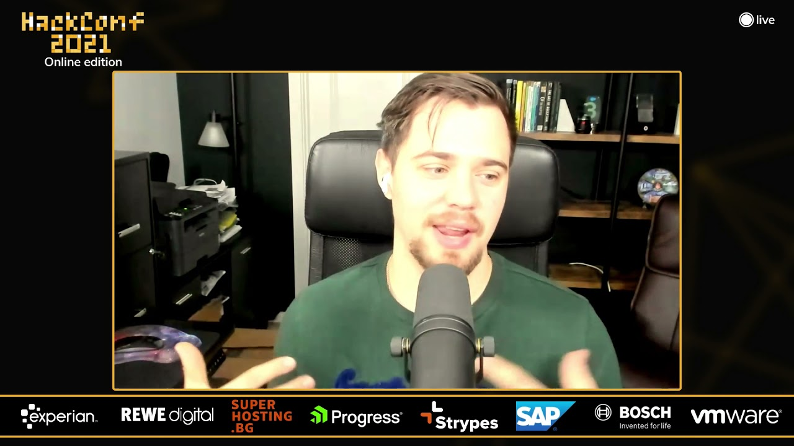

**Presence**

[Remote Work: Gateway to Freedom]()

**Location**

VirtualHackConf is Bulgaria's premier software development conference, happening in Sofia.

Organized “by developers, for developers”, it covers a wide range of software development topics, regardless of the tech stack.

HackConf 2019 will include a full day of workshops on 11th of October, and two parallel tracks of talks during both conference days - 12th and 13th of October.

**Recording**

 

<iframe width="560" height="315" src="https://www.youtube.com/embed/IN3F3vfNgOM" title="YouTube video player" frameborder="0" allow="accelerometer; autoplay; clipboard-write; encrypted-media; gyroscope; picture-in-picture" allowfullscreen></iframe>