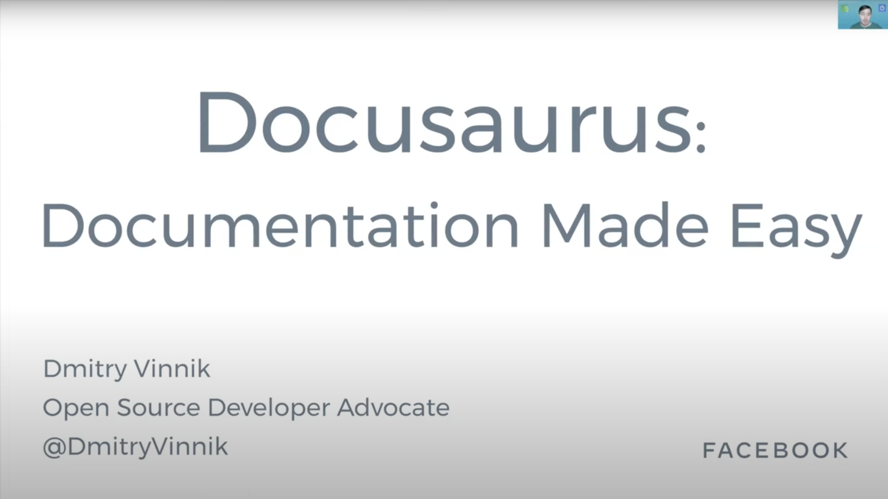

**Elevator Pitch (~300 words)**

In this session, we will walk through getting started with Docusaurus, its architecture and MDX support

**Abstract**
 
Do you know how to get someone to do something difficult? Make it easy! Documentation is one of those things: everyone understands it's important, but few want to write it. And if the docs platform is difficult to use or extend, doc writing becomes a punishment. Docusaurus is here to help!

In this session, we will walk through getting started with Docusaurus, its architecture and MDX support. We will explore built-in themes with plugins, and even create one during the talk. So, let's learn how to make doc writing enjoyable, together!

**Presented at**
 

- [Algolia Community Party: 2020](http://dvinnik.dev/events/2020/algolia-community-party)

**Recording**

 

<iframe width="560" height="315" src="https://www.youtube.com/embed/Hl_4Le_0LOc" title="YouTube video player" frameborder="0" allow="accelerometer; autoplay; clipboard-write; encrypted-media; gyroscope; picture-in-picture" allowfullscreen></iframe>

*[Algolia Community Party: 2020](http://dvinnik.dev/events/2020/algolia-community-party)*

 

**Slide Deck**

 

<iframe src="//www.slideshare.net/slideshow/embed_code/key/8m1hxUdQhH03x1" width="595" height="485" frameborder="0" marginwidth="0" marginheight="0" scrolling="no" style="border:1px solid #CCC; border-width:1px; margin-bottom:5px; max-width: 100%;" allowfullscreen> </iframe> 
 <strong> <a href="//www.slideshare.net/DmitryVinnik1/documentation-made-easy-with-docusaurus" title="Documentation Made Easy with Docusaurus" target="_blank">Documentation Made Easy with Docusaurus</a> </strong> from <strong><a href="//www.slideshare.net/DmitryVinnik1" target="_blank">Dmitry Vinnik</a></strong> 
