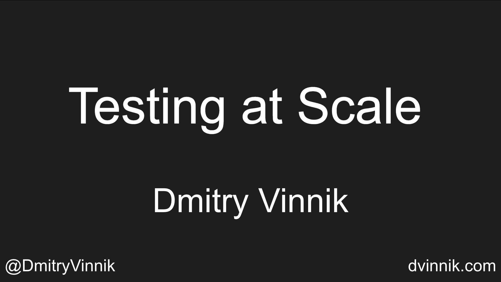

**Elevator Pitch (~300 words)**

In this session, we will discuss how the most basic testing skills and tools we use daily are transferable to any company.

**Abstract**
 
Do you ever worry that your testing skills are too limited for your company? Are you concerned that other organizations, especially the ones with a massive scale, require a completely different set of skills? 

Worry no more! This talk will look at how testing is done at companies with the scale of the likes of Salesforce and Meta. We will discuss how the most basic testing skills and tools we use daily are transferable to any company.

**Presented at**

 

- [Future of Testing Webinar: 2022](https://dvinnik.dev/videos/2020/testing-at-scale)
- [Future of Testing Forum: 2022](https://dvinnik.dev/events/2022/future-of-testing-forum)

**Recording**

 

<iframe width="560" height="315" src="https://www.youtube.com/embed/Hl_4Le_0LOc" title="YouTube video player" frameborder="0" allow="accelerometer; autoplay; clipboard-write; encrypted-media; gyroscope; picture-in-picture" allowfullscreen></iframe>

*[Future of Testing Webinar: 2022](https://dvinnik.dev/videos/2020/testing-at-scale)*

 

**Slide Deck**

 

<iframe src="//www.slideshare.net/slideshow/embed_code/key/txTPuqO5Hknf2z" width="595" height="485" frameborder="0" marginwidth="0" marginheight="0" scrolling="no" style="border:1px solid #CCC; border-width:1px; margin-bottom:5px; max-width: 100%;" allowfullscreen> </iframe> 
 <strong> <a href="//www.slideshare.net/DmitryVinnik1/testing-at-scale-at-meta-and-salesforce" title="Testing at Scale at Meta and Salesforce" target="_blank">Testing at Scale at Meta and Salesforce</a> </strong> from <strong><a href="//www.slideshare.net/DmitryVinnik1" target="_blank">Dmitry Vinnik</a></strong> 
